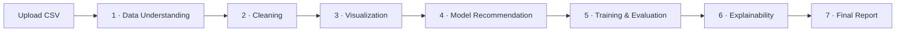

<p align="center">
  
</p>

<h1 align="center">AgentDS</h1>

<p align="center">
  A solo-built multi-agent AI data scientist — upload a CSV, get a full modeling report.
</p>

<p align="center">
  
  
  
  
  
  
</p>

---

## What is this

AgentDS takes a raw CSV and walks it through the work a data scientist would do:
understand the data, clean it, chart it, pick candidate models, train and rank
them, explain the winner, and write up the whole thing as a downloadable report.

Each stage is its own agent. The split is deliberate: **every fact, table and
metric is computed in plain pandas / scikit-learn**, and the LLM is only ever
asked to *reason* (which tools to call, which models to shortlist) or to *write
prose* (narratives, section intros). Numbers are never parsed out of model text.

It runs **fully local by default** on Ollama (`qwen3:8b`) — no API key, no data
leaving the machine — or against Claude by flipping a single environment
variable.

## The pipeline



A What-If / counterfactual agent (Module 8) is reserved in the code but **not
built yet**.

## Modules at a glance

| # | Module | What it produces | LLM role | Endpoint(s) |
|---|--------|------------------|----------|-------------|
| 1 | **Data Understanding** | Column overview, duplicates, correlations, target / problem-type guess, plain-English narrative | Agentic tool-use loop (investigates, then `submit_report`) | `POST /datasets/{id}/analyze` · `POST /datasets/{id}/quick-stats` (LLM-free) |
| 2 | **Cleaning** | New cleaned dataset + ordered step log (impute, drop, dedupe, outliers, encode, scale), each with the agent's reason | Agentic tool-use loop of mutating actions | `POST /datasets/{id}/clean` |
| 3 | **Visualization** | Plotly-ready chart specs (histogram, box, bar, correlation heatmap, time series, target relationships) + per-chart insight | 1 narration call (selects & orders charts, writes prose) | `POST /datasets/{id}/visualize` |
| 4 | **Model Recommendation** | 3–4 models from a fixed catalog, per-model rationale, preprocessing plan, primary metric | 1 reasoning call (picks catalog names + prose only) | `POST /datasets/{id}/recommend` |
| 5 | **Training & Evaluation** | Every shortlisted model fitted, 5-fold CV + held-out scores, ranked leaderboard, persisted pipelines | Optional best-effort narration (training never depends on it) | `POST /datasets/{id}/train` |
| 6 | **Explainability** | SHAP global feature importance + per-prediction top reasons for the best model | 1 narration call | `POST /datasets/{id}/explain` |
| 7 | **Report** | One assembled `FinalReport` (10 sections) copied verbatim from every upstream sidecar | 1 narration call (exec summary + section intros + conclusion) | `POST` / `GET /datasets/{id}/report` · `GET .../report/pdf` · `GET .../report/docx` (export = no LLM) |

LLM-gated endpoints return `503` when the configured provider isn't reachable;
`/quick-stats`, the report `GET`s, and the PDF/Word exports work fully offline.

## Design decisions

- **Plain FastAPI** with direct function calls between plain Python classes — no
  LangGraph or graph-orchestration framework.
- **Datasets live on local disk** — no database. Each module writes a JSON
  sidecar next to the dataset; the report agent assembles from those.
- **Facts come from tool results, not model text** — factual report fields are
  always taken from the actual pandas/sklearn output the agent retrieved.
- **Reproducible training** — `random_state=42` throughout, fixed CV splits,
  hyperparameters copied verbatim from the model catalog (never LLM-chosen).
  Every fitted pipeline (preprocessing + estimator) is persisted with `joblib`.
- The original dataset is never mutated — cleaning writes a fresh `dataset_id`.

Both the "no framework" and "no database" calls are deliberate scope choices for
a solo build, not oversights.

## Quickstart

You need **Python 3.11+** and **Node 20+**.

### One command — both services

From the repo root, after the one-time setup below (a backend venv with
`requirements.txt` installed, and `npm install` in `frontend/`):

```bash
python run.py          # Windows / WSL / macOS / Linux — same command
# or:  ./dev            (macOS / Linux / WSL)
#     dev.cmd           (Windows)
```

It starts the backend (`:8000`) and frontend (`:3000`), waits for the UI to come
up, prints **<http://localhost:3000>**, and opens it. `Ctrl+C` stops both.
Flags: `--backend-only`, `--frontend-only`, `--no-open`. It picks up
`backend/venv` (or `.venv`) automatically and creates `backend/.env` from the
example on first run.

### Or run the two services yourself, in separate terminals

### Backend — API on `:8000`

```bash
cd agentds/backend

python -m venv venv
source venv/bin/activate           # Windows: venv\Scripts\Activate.ps1

pip install -r requirements.txt
cp .env.example .env               # edit if needed

uvicorn app.main:app --reload
```

Interactive API tester (Swagger UI): <http://localhost:8000/docs> — you can
upload a CSV to `POST /datasets/upload` straight from the browser.

### Frontend — UI on `:3000`

```bash
cd agentds/frontend

npm install
npm run dev
```

Open <http://localhost:3000>. Start the backend first — its CORS is pinned to
`http://localhost:3000`.

### LLM provider

| Provider | Setup |
|----------|-------|
| **`ollama`** (default) | `ollama pull qwen3:8b` (~5.2 GB, one-time), then `ollama serve` |
| **`anthropic`** | set `AGENTDS_LLM_PROVIDER=anthropic` and `ANTHROPIC_API_KEY=<key>` in `backend/.env` |

`POST /datasets/{id}/quick-stats` needs no provider at all — a fast, fully
deterministic path for offline use or demos.

## Configuration

Set in `agentds/backend/.env` (see `.env.example`):

| Env var | Default | Purpose |
|---------|---------|---------|
| `AGENTDS_DATA_DIR` | `./data/uploads` | Where uploaded datasets are written |
| `AGENTDS_LLM_PROVIDER` | `ollama` | `ollama` or `anthropic` — one global setting for every module |
| `ANTHROPIC_API_KEY` | _(unset)_ | Only read when the provider is `anthropic` |
| `OLLAMA_HOST` | `http://localhost:11434` | Only read when the provider is `ollama` |
| `OLLAMA_MODEL` | `qwen3:8b` | Only read when the provider is `ollama` |

Frontend: `agentds/frontend/.env.local` → `NEXT_PUBLIC_API_BASE_URL`
(default `http://localhost:8000`).

Full per-module details and error semantics live in
[`backend/README.md`](backend/README.md).

## Project structure

```
agentds/
├── backend/                  FastAPI service
│   ├── app/
│   │   ├── main.py           App entrypoint — CORS + router wiring
│   │   ├── agents/           One module per file (data_understanding, cleaning,
│   │   │                       visualization, recommendation, training,
│   │   │                       explainability, report) + the LLM client
│   │   ├── routers/          HTTP endpoints, one file per stage
│   │   ├── models/           Pydantic report schemas
│   │   └── storage/          On-disk dataset + sidecar store
│   ├── data/                 Sample CSVs + uploaded datasets (gitignored)
│   └── tests/                pytest suite, one module per stage
└── frontend/                 Next.js dashboard
    ├── app/
    │   ├── page.tsx          Upload + dataset list
    │   └── datasets/[id]/    Pipeline overview + one page per stage
    ├── components/           Shared UI (StatusBadge, stage shell)
    └── lib/                  Typed API client, pipeline definition, context
```

## Tech stack

| Area | Tools |
|------|-------|
| **Backend** | FastAPI, Uvicorn, pandas, Pydantic |
| **ML** | scikit-learn, XGBoost, LightGBM, SHAP, joblib |
| **Report export** | reportlab (PDF), python-docx (Word) |
| **LLM** | Anthropic SDK, Ollama (`qwen3:8b`) via one provider-agnostic client |
| **Frontend** | Next.js 16 (App Router), React 19, Tailwind CSS v4, Plotly (`react-plotly.js`), `react-markdown` + `remark-gfm` |
| **Tooling** | pytest, ESLint |

## Tests

```bash
cd agentds/backend
pip install -r requirements-dev.txt
pytest
```

~13 test modules under `backend/tests/`, one per pipeline stage.

## Roadmap

<details>
<summary>Planned, not yet built</summary>

- **Module 8 — What-If / counterfactual agent** (`whatif` kind is already
  reserved in the backend and frontend, but no implementation exists).
- Authentication.
- Database-backed persistence to replace the on-disk sidecar store.

</details>

## License

[MIT](LICENSE).

---

<p align="center">
  Deep API reference &amp; per-module error semantics →
  <a href="backend/README.md"><code>backend/README.md</code></a>
</p>
